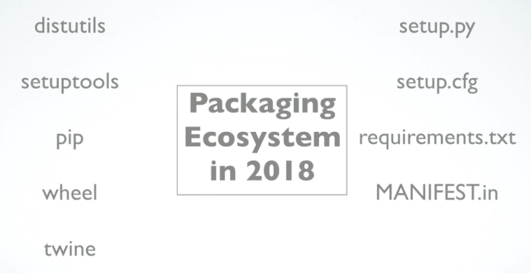

## Packaging (and Enviroments)

**Virtualenv**

Pipenv vs virtualenv: [https://medium.com/@dakota.lillie/an-introduction-to-virtual-environments-in-python-ce16cda92853](https://medium.com/@dakota.lillie/an-introduction-to-virtual-environments-in-python-ce16cda92853)

Venv: [https://medium.com/@rahul3012_37725/a-very-basic-guide-to-python-virtual-environments-a53d1e191490](https://medium.com/@rahul3012_37725/a-very-basic-guide-to-python-virtual-environments-a53d1e191490)

```bash
# install virtualenv
pip install virtualenv

#Prima di lanciare il successivo comando controllare di essere su conda e fare:
conda activate development #la versione di conda che usate deve essere >= versione desiderata

# generate a new virtualenv in a specific path
virtualenv --python=3.6 <path_nome_env>

#### UNIX (mac and linux)
source <path_nome_env>/bin/activate

#### WINDOWS
<path_nome_env>\scripts\activate

#### Visual Studio Code 
#(install Microsoft Python Extension and then click on python in the bottom tab)
#Windows
navigate to -> <path_nome_env>\scripts\<python3.6>
#UNIX
navigate to -> <path_nome_env>/bin/<python3.6>

#Warning: if you are using another python version, change python3.6 to your current version

#Then install requirements.txt
pip install -r requirements.txt
```

Prevent conda to activate default base environment by default `conda config --set auto_activate_base false`

[https://www.youtube.com/watch?v=asL0dbN6pAY](https://www.youtube.com/watch?v=asL0dbN6pAY)

[https://www.youtube.com/watch?v=1GIIaGbL9qQ](https://www.youtube.com/watch?v=1GIIaGbL9qQ)

**Inside the cheeseshop: How Python Packaging Works (Dustin Ingram)** https://www.youtube.com/watch?v=AQsZsgJ30AE



PEP 518: introduce il pyproject.toml che rimpiazza quasi tutto.

**Publish package to Pypi (old school)**

[https://www.youtube.com/watch?v=GIF3LaRqgXo&ab_channel=CodingTech](https://www.youtube.com/watch?v=GIF3LaRqgXo&ab_channel=CodingTech)

**Use uf PipEnv**

[https://hackersandslackers.com/pipenv-python-environment-management/](https://hackersandslackers.com/pipenv-python-environment-management/)

**Differenze tra PipEnv, Pip e Conda (DevOps Concepts)**

[https://towardsdatascience.com/devops-for-data-science-making-your-python-project-reproducible-f55646e110fa](https://towardsdatascience.com/devops-for-data-science-making-your-python-project-reproducible-f55646e110fa)